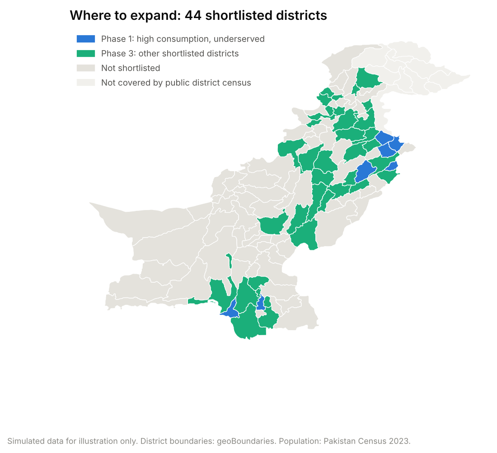
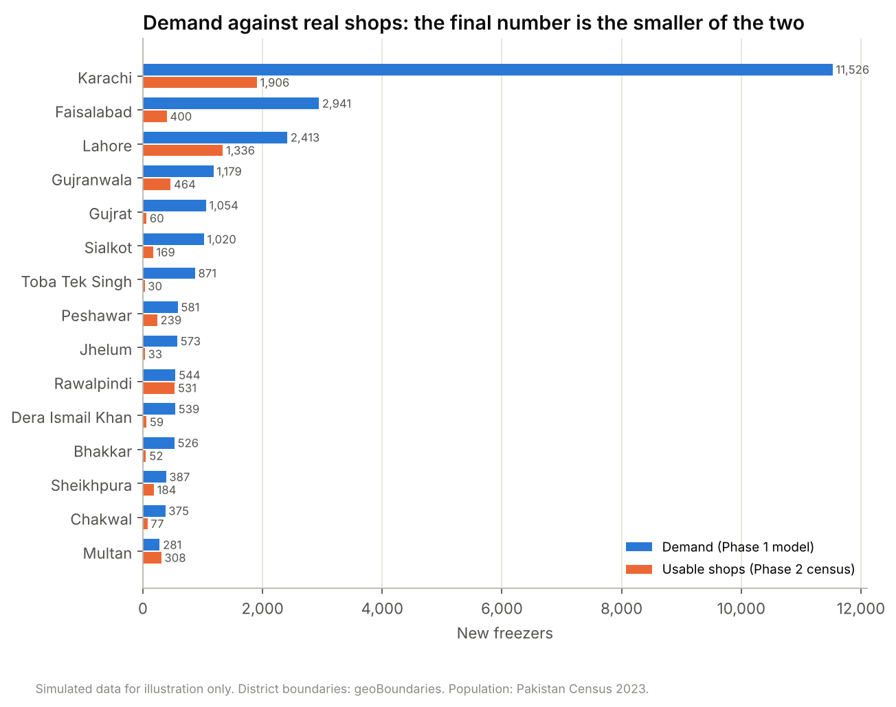
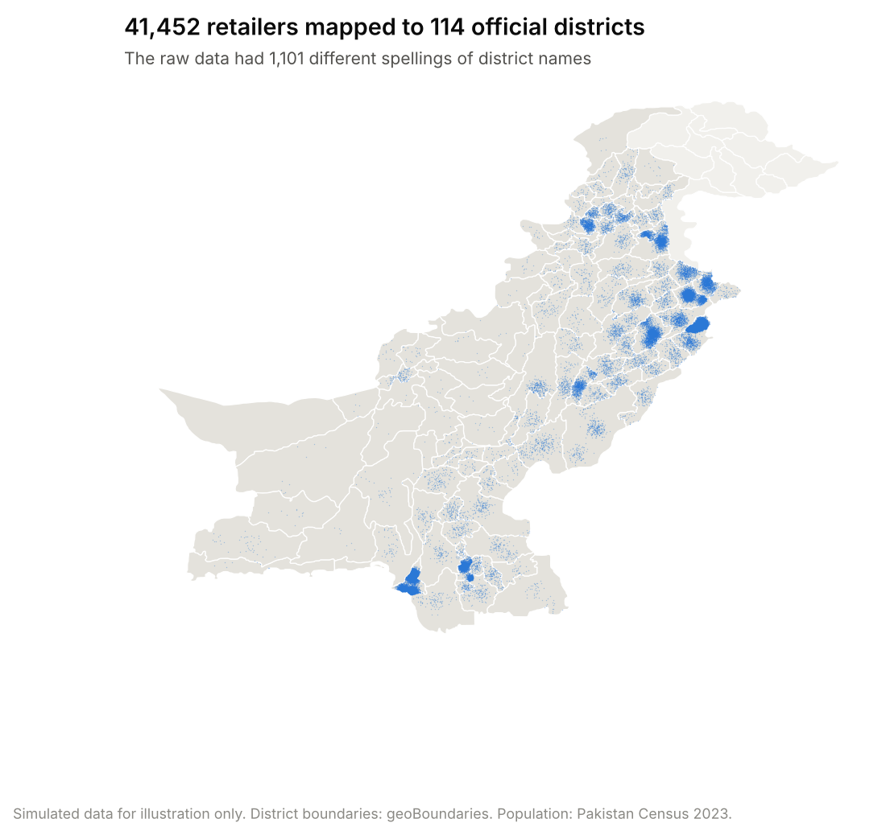
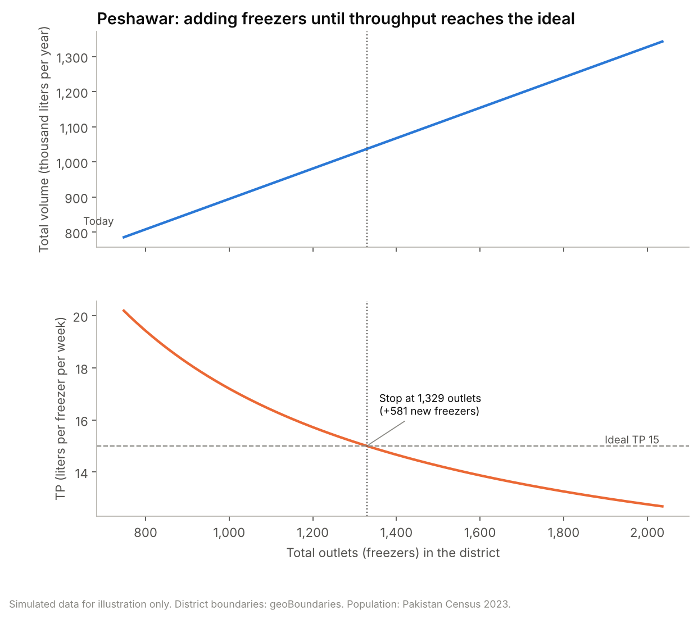
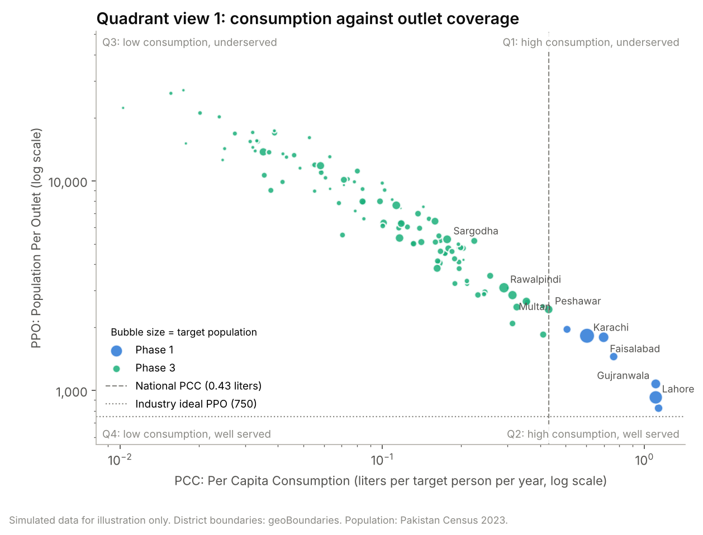
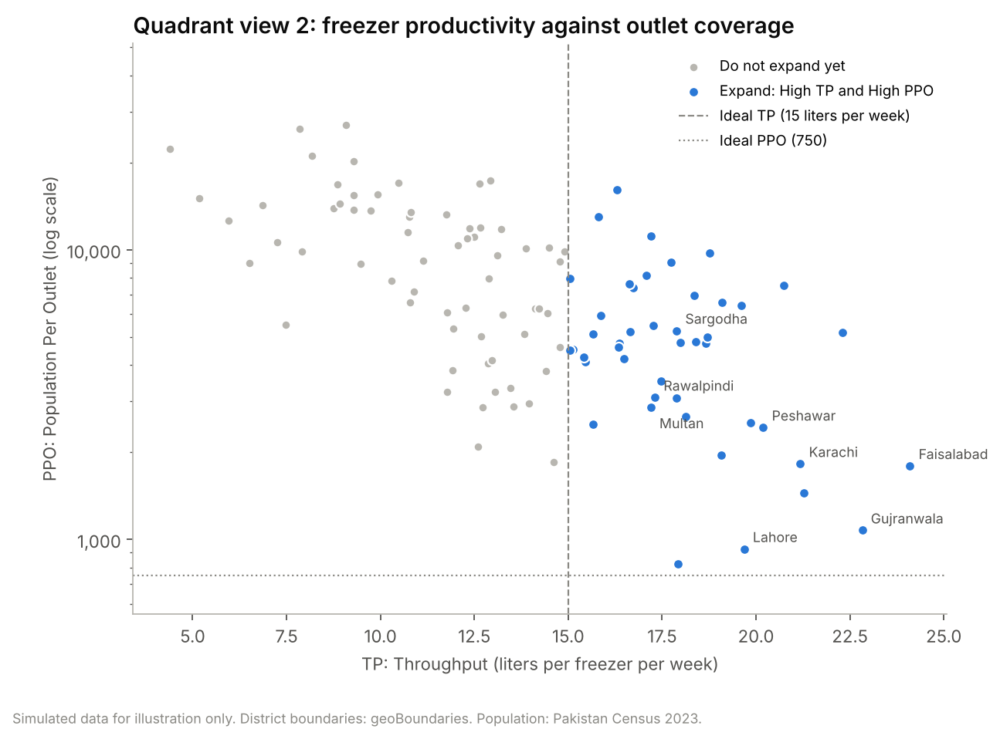
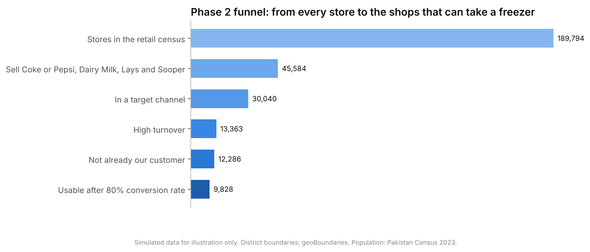

# Retail Footprint Expansion Model

**How many freezers should an ice cream business invest in, in every district of Pakistan, and do enough real shops exist to take them?**

A district level investment model built with geospatial data science (Python, GeoPandas, Shapely), delivered three ways: as a Python pipeline for analysts, as a formula driven Excel model for non-technical teams, and as a one click VBA macro.


> [!IMPORTANT]
> **All sales, retailer and store data in this repository is simulated.** It is not real company data, and it exists only to explain the method.
> The only real inputs are public: district boundaries (geoBoundaries) and district population (Pakistan Population Census 2023).
> This is a public recreation of a project I led in 2024 at the ice cream division of a multinational in Pakistan. No company names, logos, figures or confidential data are included, and all code was rebuilt for this public version.

---

## At a glance

| | |
|---|---|
| **Business question** | How many new freezers to invest in, in each district, and in what order |
| **Unit of analysis** | 115 districts (instead of 5 sales regions) |
| **Phase 1: demand** | A district model built on PCC (Per Capita Consumption), PPO (Population Per Outlet) and TP (Throughput) |
| **Phase 2: supply** | A third party retail census used to check that enough suitable shops actually exist |
| **Key technique** | Point in polygon mapping of every retailer's GPS coordinates to official district boundaries |
| **Delivered as** | Python pipeline, Excel formula model, VBA macro, interactive map, sales target list |
| **Verified** | Python, Excel formulas and the VBA macro give identical answers for all 115 districts |

<p align="center">
  
  
</p>

---

## Contents

1. [The business problem](#1-the-business-problem)
2. [Why district level, not regional](#2-why-district-level-not-regional)
3. [The data problem and the geospatial fix](#3-the-data-problem-and-the-geospatial-fix)
4. [Phase 1: the demand model](#4-phase-1-the-demand-model)
5. [Phase 2: do enough real shops exist?](#5-phase-2-do-enough-real-shops-exist)
6. [From recommendation to an action plan](#6-from-recommendation-to-an-action-plan)
7. [Results (simulated data)](#7-results-simulated-data)
8. [Company wide impact](#8-company-wide-impact)
9. [Three ways to use the model: Python, Excel and VBA](#9-three-ways-to-use-the-model-python-excel-and-vba)
10. [Repository structure](#10-repository-structure)
11. [How to run it](#11-how-to-run-it)
12. [Data sources and licenses](#12-data-sources-and-licenses)
13. [Glossary](#13-glossary)

---

## 1. The business problem

In 2024, the business was preparing a major capital investment in new freezers (also called cabinets). Every freezer placed in a shop is a long term commitment, so the question was not only "how many?" but "where exactly?".

The background:

* The **asset base (number of freezers) had stayed flat for years**, while the snacking category kept growing.
* **TP (Throughput, liters sold per freezer per week) had been falling** for years. Past expansion had gone to the outskirts of main towns instead of building strongholds where economic activity was highest.
* **Smaller competitors were taking share**, often by targeting the business's best outlets.

So the brief was: **find out how many freezers each part of the country can really support, and invest there first.**

## 2. Why district level, not regional

Investment used to be planned for **5 large sales regions**. But demand is not regional. It is driven by districts and cities, which can be very different from each other even inside one region. Lahore and a rural district next to it behave nothing alike.

| | Former approach | This model |
|---|---|---|
| Unit of planning | 5 sales regions | 115 districts |
| Question answered | "How much for the region?" | "How many freezers in each district, and in what order?" |
| Who can use the result | Regional sales leadership | Sales, Finance, Marketing, Operations, Supply Chain, HR |

## 3. The data problem and the geospatial fix

**The problem.** Every retailer record had a district name typed in by hand. The same district appeared under many spellings (`Lahore`, `lahore`, `LHR`, `Lahore Cantt`, `Lahre`, `Lahore District`, or left blank). Grouping sales by that column would create hundreds of fake districts. In the simulated data, **1,101 different spellings** stand in for 115 real districts.

**The fix.** Ignore the typed name. Every retailer also has GPS coordinates (latitude and longitude). Each point is tested against the **official district boundaries** to find which district it falls inside (a point in polygon test). That gives one clean, correct district per retailer.

**Data cleaning before mapping:**

* Latitude and longitude typed the wrong way round are detected and swapped back.
* Missing or impossible coordinates (for example `0, 0`) are flagged, never guessed.

| Measure (simulated data) | Value |
|---|---|
| Retailer records | 41,544 |
| Distinct typed district names | 1,101 |
| Coordinates fixed (latitude and longitude swapped) | 153 |
| Coordinates invalid (missing or outside Pakistan) | 92 |
| Records mapped to an official district | 41,452 |



**Original code and the rebuilt version.**
[`legacy/main.py`](legacy/main.py) is the original script I wrote: it parsed raw boundary coordinate strings with regex, built Shapely polygons, and looped over every retailer and every district. The rebuilt module [`src/footprint/geo.py`](src/footprint/geo.py) does the same test with a single GeoPandas spatial join (which uses a spatial index), adds the coordinate cleaning above, and is reused unchanged in Phase 2 to map the retail census stores.

**Cost saving.** Bringing in a third party vendor just to map stores to districts would have cost **millions of PKR**. This in-house Python solution did it at no extra cost.

## 4. Phase 1: the demand model

### 4.1 The metrics

For every district (base year 2024, with 2022 and 2023 for growth):

| Metric | Formula | What it tells us |
|---|---|---|
| **Target population** | Population x LSM 5+ share | People who can afford ice cream regularly |
| **PCC** (Per Capita Consumption) | Volume / Target population | How much people buy |
| **PPO** (Population Per Outlet) | Target population / Outlets | How well served people are. High PPO means underserved |
| **TP** (Throughput) | Volume / Outlets / Weeks | How productive each freezer is (one outlet means one freezer) |
| **NI TP** (New Induction Throughput) | Same as TP, for retailers that got a freezer in the base year | What a brand new freezer realistically sells |
| **GOLY** and **CAGR** | Growth Over Last Year, Compound Annual Growth Rate | Momentum |

Each district is also placed in a **PCC layer** and a **PPO layer** (Layer 01 strongest, Layer 05 weakest).

### 4.2 How many freezers to add

These come straight from my working notes during the project. Since Population = Consumption / PCC, PPO can be written as:

```
PPO = (Consumption / PCC) x (1 / Outlets)
```

When new outlets are added, consumption grows by the current volume (CV) plus the new volume (NV) from the new outlets:

```
New Volume (n)  = Current Volume + n x (Weeks x NI TP + First fill)
New TP (n)      = New Volume (n) / (Current Outlets + n) / Weeks
New PPO (n)     = Target population / (Current Outlets + n)
```

Every new freezer adds volume, but it also spreads demand across more freezers, so **TP per freezer falls**. The rule: keep adding freezers until **TP falls to the Ideal TP of 15 liters per week, or PPO falls to the industry ideal of 750**, whichever comes first. Districts already below either line get no new freezers.

* Each new freezer is assumed to sell at the district's **NI TP** (the throughput of last year's new retailers), plus an **80 liter first fill** to stock it. If a district had no new retailers, the sales region's average NI TP is used. A setting switches this to the district's average TP.
* In the original Excel model, this was solved with **Goal Seek**, district by district. The rebuilt model solves the equation directly, and the VBA macro replaces Goal Seek with a one click loop.



### 4.3 Prioritization: two quadrant views

**View 1 (as presented to leadership): PCC against PPO.** Lines at the national PCC and the industry ideal PPO.

* **Quadrant 1: High PCC, High PPO.** People buy a lot but there are too few outlets. **Phase 1, top priority.**
* **Quadrant 2: High PCC, Low PPO.** Well served, but people want more. **Phase 2.**
* **Quadrants 3 and 4.** **Phase 3.**



**View 2 (from the working notes): TP against PPO.** Lines at the Ideal TP (15) and the ideal PPO (750). High TP and High PPO is the clear "expand" box.



**Expansion waves (from the strategy).** Build strongholds before spreading out: first **strongholds** (citadel and distributor based districts), then their **neighbouring districts**, then **high population** districts, then the rest. Districts are ranked by wave, then phase, then size of the opportunity, and the **top 50** form the shortlist (44 districts qualified in the simulated data).

## 5. Phase 2: do enough real shops exist?

Phase 1 says how many freezers the **demand** can support, for example 20,000. Phase 2 asks the practical question: **do 20,000 suitable retailers even exist, ready to take a freezer and partner with the business?**

To answer it, the business worked with a **third party retail census agency** that provided store level data with GPS coordinates, and a mobile application for the sales team. The method:

1. **Filter to high potential stores.** A store counts only if it meets **all** of:
   * it sells the biggest snacking competitors: **Coke or Pepsi, Dairy Milk, Lays and Sooper** (proof of the right shoppers and turnover),
   * it is in a **target channel**: Grocery, Bakery, Supermarket, Petro Mart or Pharmacy,
   * it has **high turnover**.
2. **Map every store to its district** with the same geospatial code as Phase 1.
3. **Remove existing customers.** Census stores within 25 meters of a current customer are the same shop (matched with a nearest neighbour search).
4. **Apply a conversion rate of 80 percent**, because not every shop owner will agree to take a freezer.
5. **Final recommendation = the smaller of Phase 1 demand and Phase 2 usable supply.** Each district is labeled "Supply constrained" or "Demand constrained".



This step changed the answer in most districts. In the simulated data, demand alone would justify 26,899 new freezers in the shortlisted districts, but only **6,765** can realistically be placed. That is exactly the kind of costly mistake Phase 2 exists to prevent.

## 6. From recommendation to an action plan

* **Budget scenarios.** If only a fixed number of freezers is funded (4,000 or 6,000 in the simulation), they are shared across shortlisted districts in proportion to each district's final recommendation, using a largest remainder split so the total is exact.
* **Phasing.** Each district's freezers are split across **2025, 2026 and 2027** (300, 300 and 250 out of every 850, as in the original plan).
* **Sales target list.** For every shortlisted district, the exact eligible stores to visit, highest turnover first, with a rollout year: [`outputs/tables/sales_target_list.csv`](outputs/tables/sales_target_list.csv).
* **Interactive map.** [`outputs/sales_target_map.html`](outputs/sales_target_map.html) shows every target store by rollout year, over the shortlisted districts (download it and open it in a browser).

## 7. Results (simulated data)

Top 10 districts of the shortlist ([full table](outputs/tables/expansion_plan_top50.csv)):

| Rank | District | Nature | Phase | Outlets today | TP today | PPO today | Phase 1 demand | Usable shops | Final | Constraint |
|---:|---|---|---|---:|---:|---:|---:|---:|---:|---|
| 1 | Karachi | Stronghold | Phase 1 | 8,049 | 21.2 | 1,824 | 11,526 | 1,906 | 1,906 | Supply constrained |
| 2 | Faisalabad | Stronghold | Phase 1 | 2,113 | 24.1 | 1,794 | 2,941 | 400 | 400 | Supply constrained |
| 3 | Lahore | Stronghold | Phase 1 | 10,222 | 19.7 | 927 | 2,413 | 1,336 | 1,336 | Supply constrained |
| 4 | Gujranwala | Stronghold | Phase 1 | 2,722 | 22.8 | 1,075 | 1,179 | 464 | 464 | Supply constrained |
| 5 | Gujrat | Stronghold | Phase 1 | 655 | 19.1 | 1,957 | 1,054 | 60 | 60 | Supply constrained |
| 6 | Sialkot | Stronghold | Phase 1 | 1,093 | 21.3 | 1,451 | 1,020 | 169 | 169 | Supply constrained |
| 7 | Hyderabad | Stronghold | Phase 1 | 2,003 | 17.9 | 824 | 196 | 308 | 196 | Demand constrained |
| 8 | Peshawar | Stronghold | Phase 3 | 748 | 20.2 | 2,436 | 581 | 239 | 239 | Supply constrained |
| 9 | Rawalpindi | Stronghold | Phase 3 | 1,148 | 17.3 | 3,091 | 544 | 531 | 531 | Supply constrained |
| 10 | Sheikhpura | Stronghold | Phase 3 | 613 | 18.1 | 2,660 | 387 | 184 | 184 | Supply constrained |

| Headline (simulated) | Value |
|---|---|
| Current outlets (freezers) | 38,616 |
| Shortlisted districts | 44 |
| Phase 1 demand, shortlisted districts | 26,899 new freezers |
| Phase 2 usable shops, shortlisted districts | 7,304 |
| **Final recommendation** | **6,765 new freezers** |
| Rollout 2025 / 2026 / 2027 | 2,398 / 2,379 / 1,988 |

## 8. Company wide impact

The real project went far beyond one investment number. Splitting the business into districts gave every department a common, data driven map of the market.

* **Saved millions of PKR.** The store to district mapping was built in-house in Python, instead of paying a third party vendor millions of PKR just to map stores to districts.
* **CAPEX (Capital Expenditure) planning.** Knowing the expected volume in each district let the business plan **factory capacity** for the extra ice cream that would be sold.
* **OPEX (Operating Expenditure) planning.** The district plan showed operations teams:
  * how many more **ice cream delivery vehicles** were needed,
  * how many vehicles were needed to **deliver and install the new freezers**,
  * how many **new hires and salaries** the expansion required,
  * how many **new distributors** to add across the country, since much more ice cream would be sold.
* **District specific strategies, not regional ones.** Marketing, Operations and Finance could now plan for each district instead of huge regions. For example, which **advertising** to run in which city and which **market activations** to run where, because consumers in Lahore behave differently from consumers in Islamabad.
* **Finance at district level.** Finance could plan spending and track earnings district by district, and the Finance team adopted this way of working.
* **A first of its kind method.** The approach was presented to regional leadership, and Pakistan was the only market globally to adopt this methodology.

## 9. Three ways to use the model: Python, Excel and VBA

Not everyone in a business writes code. So the model was built for three kinds of users, and **all three give identical answers**.

| Version | For | Where |
|---|---|---|
| **Python pipeline** | Analysts and data scientists. Runs everything end to end, including the geospatial mapping, Phase 2, charts and the map | [`src/footprint/`](src/footprint), [`run_pipeline.py`](run_pipeline.py), [notebook](notebooks/footprint_expansion_walkthrough.ipynb) |
| **Excel formula model** | Sales, Finance and Marketing colleagues who do not code. Change a blue input cell (for example the Ideal TP) and the whole model recalculates | [`excel/Retail_Footprint_Expansion_Model.xlsx`](excel/Retail_Footprint_Expansion_Model.xlsx) |
| **VBA macro** | Anyone in Excel who wants the old Goal Seek step done in one click for every district | [`vba/FootprintModel.bas`](vba/FootprintModel.bas) |

I built the Excel and VBA versions so that non-technical teams could keep using the model on their own, even after I left the company. The original Python and VBA files stayed with the company, so all three versions in this repository were **rebuilt** for this public version, with simulated data. The one original piece of code is [`legacy/main.py`](legacy/main.py).

**How the three are kept in sync:**

* [`tests/test_excel_matches_python.py`](tests/test_excel_matches_python.py) checks that every Excel formula result (recommendations, limiting factors, ranks, budget splits, rollout years) matches Python for all 115 districts.
* [`scripts/check_vba_with_libreoffice.py`](scripts/check_vba_with_libreoffice.py) runs the VBA macro headlessly in LibreOffice and confirms it matches the Excel formulas for all 115 districts.
* [`tests/test_model.py`](tests/test_model.py) checks that Python's direct solution equals the one outlet at a time search that the macro uses.

**Using the Excel model:**

1. Open `excel/Retail_Footprint_Expansion_Model.xlsx`.
2. Read the **Read Me** sheet, then change any blue cell on the **Inputs** sheet.
3. Read the results on the **Model** and **Summary** sheets.

**Using the VBA macro:**

1. Open the Excel model, then open the Visual Basic Editor (Windows: `Alt + F11`. Mac: Tools > Macro > Visual Basic Editor).
2. Choose File > Import File and select `vba/FootprintModel.bas`.
3. Save the workbook as an Excel Macro-Enabled Workbook (`.xlsm`).
4. Run the macro `RunFootprintModel`. Results appear on the **Macro Results** sheet, next to the formula answer, with a match check.

## 10. Repository structure

```
retail-footprint-expansion-model/
├── README.md
├── run_pipeline.py                  # runs everything end to end
├── requirements.txt
├── data/
│   ├── raw/                         # PUBLIC: district boundaries, 2023 Census population
│   ├── simulated/                   # SIMULATED: retailers, retail census, district attributes
│   └── processed/                   # model output: one row per district
├── src/footprint/
│   ├── config.py                    # every setting (Ideal TP, Ideal PPO, conversion rate, budgets)
│   ├── geo.py                       # geospatial district mapping and coordinate cleaning
│   ├── model.py                     # Phase 1: metrics, outlet recommendation, prioritization
│   ├── census.py                    # Phase 2: census filters, existing customers, reality check
│   ├── rollout.py                   # budget scenarios, phasing, sales target list
│   ├── charts.py, store_map.py      # figures and the interactive map
│   ├── excel_export.py              # builds the formula driven Excel model
│   └── simulate.py                  # generates the simulated data
├── excel/                           # Excel model (live formulas)
├── vba/FootprintModel.bas           # VBA macro
├── legacy/main.py                   # original point in polygon script
├── notebooks/                       # step by step walkthrough
├── outputs/                         # figures, tables, interactive map
├── scripts/                         # data preparation and the VBA check
└── tests/                           # 21 tests
```

## 11. How to run it

Requires Python 3.10 or newer.

**Terminal** (type these commands one at a time):

```bash
git clone https://github.com/mbaqirdilawari/retail-footprint-expansion-model.git
cd retail-footprint-expansion-model
python -m venv .venv
source .venv/bin/activate          # on Windows: .venv\Scripts\activate
pip install -r requirements.txt
python run_pipeline.py             # builds every table, chart, the map and the Excel model
python -m pytest                   # runs the 21 tests
```

* `python run_pipeline.py --simulate` regenerates the simulated data first (it is fixed by a random seed, so the result is the same every time).
* Open `notebooks/footprint_expansion_walkthrough.ipynb` for the guided walkthrough.
* Every setting is in [`src/footprint/config.py`](src/footprint/config.py).

## 12. Data sources and licenses

| Data | Type | Source |
|---|---|---|
| District boundaries (ADM2) and provinces (ADM1) | Public | [geoBoundaries](https://www.geoboundaries.org/), public domain |
| District population, urban share, growth (2017 to 2023) | Public | Pakistan Bureau of Statistics, Population Census 2023, via [pakistan_census_2023_tables](https://github.com/fahad-mirza/pakistan_census_2023_tables) (MIT). Prepared by [`scripts/prepare_census_population.py`](scripts/prepare_census_population.py) |
| Retailers, volumes, LSM shares, district attributes, retail census stores | **Simulated** | [`src/footprint/simulate.py`](src/footprint/simulate.py) |

Notes:

* Gilgit-Baltistan and Azad Kashmir are not covered by the public district census tables, so the model covers the four provinces and Islamabad (115 districts).
* Districts created after 2019 are added back into the boundary district they were carved out of, so every population figure matches a map polygon.
* Brand names in the Phase 2 filter are used only to describe the method. All store data is simulated.

Code: MIT License (see [LICENSE](LICENSE)).

## 13. Glossary

| Term | Meaning |
|---|---|
| **PCC** | Per Capita Consumption: liters of ice cream per target person per year |
| **PPO** | Population Per Outlet: target people for every freezer outlet. High PPO means underserved |
| **TP** | Throughput: liters sold per freezer per week. One outlet means one freezer |
| **NI** | New Induction: a retailer that received a freezer during the year |
| **NI TP** | Throughput of newly inducted retailers |
| **LSM 5+** | Living Standards Measure 5 and above: the share of people who can afford ice cream regularly |
| **GOLY** | Growth Over Last Year |
| **CAGR** | Compound Annual Growth Rate |
| **CAPEX** | Capital Expenditure: long term investments such as freezers and factory capacity |
| **OPEX** | Operating Expenditure: running costs such as vehicles, salaries and distribution |
| **Ideal TP** | Benchmark throughput (15 liters per freezer per week). Below it, more freezers stop paying off |
| **Ideal PPO** | Industry benchmark population per outlet (750) |
| **First fill** | Liters needed to stock a brand new freezer the first time (80) |
| **Stronghold** | A citadel or distributor based district where the business is already strong |
| **Census universe** | Census stores that pass all filters and are not yet customers |
| **Conversion rate** | Share of the census universe expected to accept a freezer (80 percent) |

---

**Author:** Muhammad Baqir, MS in Interdisciplinary Data Science, Duke University.
